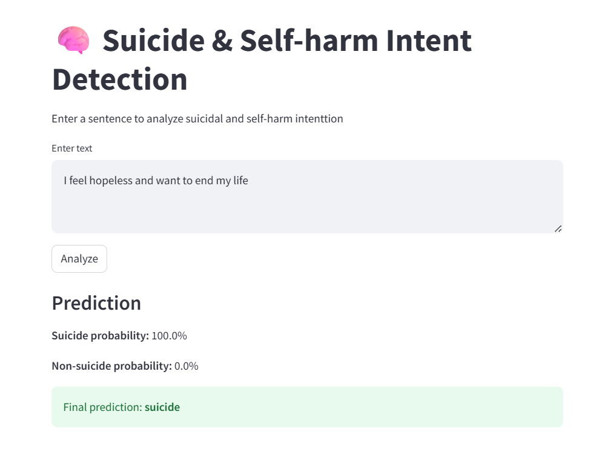

# Suicide and Self-Harm Intention Detection Web App

## Project Overview

This project develops a **Machine Learning web application** that analyzes a user’s input sentence and predicts whether it indicates **suicidal or self-harm intention** or **non-suicidal / non-self-harm content**.

The system applies **Natural Language Processing (NLP)** techniques for text cleaning and feature extraction, followed by a **Decision Tree classifier** trained on labeled text data.

The trained model is deployed using **Streamlit**, allowing users to interactively test sentences through a simple web interface.

⚠️ **Important:**
This tool is intended **for educational and research purposes only**. It is **not a medical, psychological, or clinical diagnostic tool**.

Below is the deployed application interface.



[Dataset Link](https://www.kaggle.com/datasets/nikhileswarkomati/suicide-watch)

---

## Project Objectives

* Perform **text preprocessing** to clean and normalize textual data.
* Convert textual data into numerical features using **TF-IDF vectorization**.
* Train a **machine learning classifier** to detect suicide and self-harm signals.
* Deploy the trained model with **Streamlit** for real-time predictions.
* Provide **probability scores** for both classes.

---

## Technologies Used

* **Python**
* **Streamlit**
* **Scikit-learn**
* **NLTK**
* **BeautifulSoup**
* **Contractions**
* **Joblib**

---

## Text Preprocessing

The preprocessing pipeline prepares raw text for machine learning.

Steps include:

1. Removing **HTML tags** using BeautifulSoup
2. Expanding **contractions** (e.g., *can't → cannot*)
3. Removing **emojis and special symbols**
4. Removing **URLs**
5. Converting text to **lowercase**
6. Removing **punctuation**
7. Removing **stopwords**
8. Performing **lemmatization** using WordNet Lemmatizer

Example:

Input sentence:

```
"I can't take this anymore. I feel like ending my life."
```

After preprocessing:

```
cannot take anymore feel like ending life
```

---

## Feature Engineering

The cleaned text is converted into numerical features using:

**TF-IDF (Term Frequency – Inverse Document Frequency)**

Configuration:

```
TfidfVectorizer(max_features=15000)
```

This converts the text dataset into a **15000-dimensional feature representation** used by the machine learning model.

---

## Machine Learning Model

### Model Training and Evaluation

To determine the most effective approach for detecting **suicide and self-harm intention**, multiple machine learning models were trained and evaluated using the same TF-IDF feature representation.

The following models were compared:

* Logistic Regression
* Linear Support Vector Classifier (LinearSVC)
* Stochastic Gradient Descent (SGD)
* Multinomial Naive Bayes
* XGBoost

Each model was evaluated using:

* **F1 Score** (primary metric)
* **Precision**
* **Recall**
* **Training Time**
* **Prediction Time**

---

### Model Performance Comparison

| Model               | F1 Score   | Precision | Recall | Train Time (s) | Prediction Time (s) |
| ------------------- | ---------- | --------- | ------ | -------------- | ------------------- |
| **LinearSVC**       | **0.9274** | 0.9276    | 0.9274 | 3.19           | 0.006               |
| Logistic Regression | 0.9268     | 0.9270    | 0.9269 | 2.55           | 0.009               |
| SGD                 | 0.9209     | 0.9213    | 0.9209 | 0.66           | 0.006               |
| XGBoost             | 0.9024     | 0.9036    | 0.9025 | 121.74         | 0.346               |
| MultinomialNB       | 0.8475     | 0.8479    | 0.8475 | 0.11           | 0.014               |

---

### Model Selection

* **LinearSVC achieved the highest F1 Score**, indicating the best overall balance between precision and recall.
* It also demonstrated **very fast prediction time**, making it highly efficient.

However:

**Logistic Regression was selected for deployment** in the Streamlit application.

---

### Why Logistic Regression Was Chosen

Although LinearSVC slightly outperformed other models, it **does not support probability outputs (`predict_proba`)**, which are essential for:

* Displaying **confidence scores (%)** to users
* Improving **interpretability in sensitive applications**
* Supporting **better user understanding and trust**

Logistic Regression provides:

* Probability predictions (`predict_proba`)
* Comparable performance to LinearSVC
* Efficient training and inference
* Better suitability for real-world deployment

---

### Final Model Performance (Logistic Regression)

```
              precision    recall  f1-score   support

           0       0.92      0.94      0.93     23287
           1       0.93      0.92      0.93     23128

    accuracy                           0.93     46415
   macro avg       0.93      0.93      0.93     46415
weighted avg       0.93      0.93      0.93     46415
```

This shows **strong and balanced performance across both classes**, making it reliable for deployment.

---

### Example Prediction

Input:

```
"I can't take this anymore. I feel like ending my life"
```

Output:

```
Potential suicide/self-harm intention
```

---

## Saved Models

To deploy the application efficiently, trained components are saved using **Joblib**.

Saved files:

```
model.pkl
tfidf.pkl
label_encoder.pkl
```

These files store:

| File              | Description                                |
| ----------------- | ------------------------------------------ |
| model.pkl         | Trained Decision Tree classification model |
| tfidf.pkl         | TF-IDF vectorizer used to encode text      |
| label_encoder.pkl | Encoder mapping labels to numeric values   |

Saving these components prevents **retraining the model each time the application runs**.

---

## Streamlit Web Application

The Streamlit interface allows users to:

1. Enter a sentence or short text
2. Click **Analyze**
3. Receive prediction results and probability scores

Example output:

```
Suicide / Self-Harm probability: 91.82%
Non-suicide probability: 8.18%

Final prediction: suicide/self-harm
```

---

## Project Structure

```
suicide_selfharm_detection_app
│
├── app.py
├── model.pkl
├── tfidf.pkl
├── label_encoder.pkl
├── requirements.txt
└── README.md
```

---

## How to Run the App

### Step 1 — Clone the repository

```
git clone https://github.com/your-username/suicide-selfharm-detection-app.git
cd suicide-selfharm-detection-app
```

### Step 2 — Install dependencies

```
pip install -r requirements.txt
```

### Step 3 — Run the Streamlit application

```
streamlit run app.py
```

The application will automatically open in your web browser.

---

## 🧪 Example Test Sentences

Example 1:

```
I feel hopeless and want to end my life
```

Example 2:

```
Sometimes I think about hurting myself
```

Example 3:

```
Today was a beautiful day and I feel happy
```

---

## Ethical Considerations

Applications that detect suicidal or self-harm intentions must be developed responsibly.

Key considerations:

* Predictions **must not replace professional mental health evaluation**
* The system **should not be used for clinical diagnosis**
* AI predictions may contain **false positives or false negatives**
* Real-world applications should provide **mental health resources or crisis hotline information**

---

## Future Improvements

Potential enhancements include:

* Using **Logistic Regression or Linear SVM** for stronger baseline performance
* Implementing **Deep Learning models (BERT or RoBERTa)**
* Adding **model explainability with SHAP**
* Deploying using **FastAPI + Streamlit architecture**
* Integrating **mental health support resources and hotline information**
* Adding **confidence visualizations and dashboards**

---

## References

* NLTK Documentation
* Scikit-learn Documentation
* Streamlit Documentation
